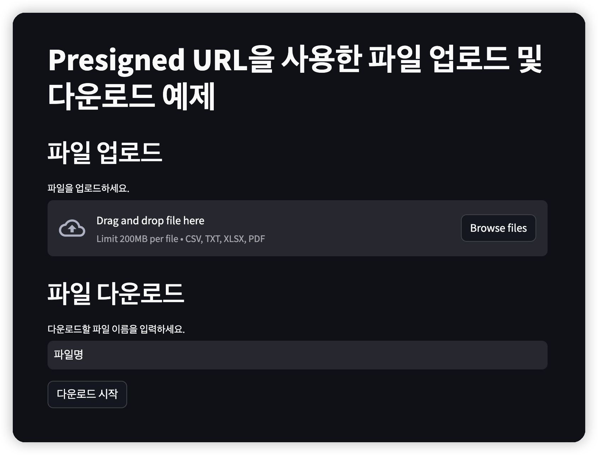
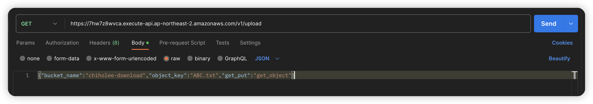

# upload-presigned-url


# frontend
## streamlit run
``` bash
streamlit run ui.py
```


# infra
``` bash
cd tf
terraform init
terraform apply
```


# postman test

``` json
{"bucket_name":"chiholee-download","object_key":"ABC.txt","get_put":"get_object"}
```


